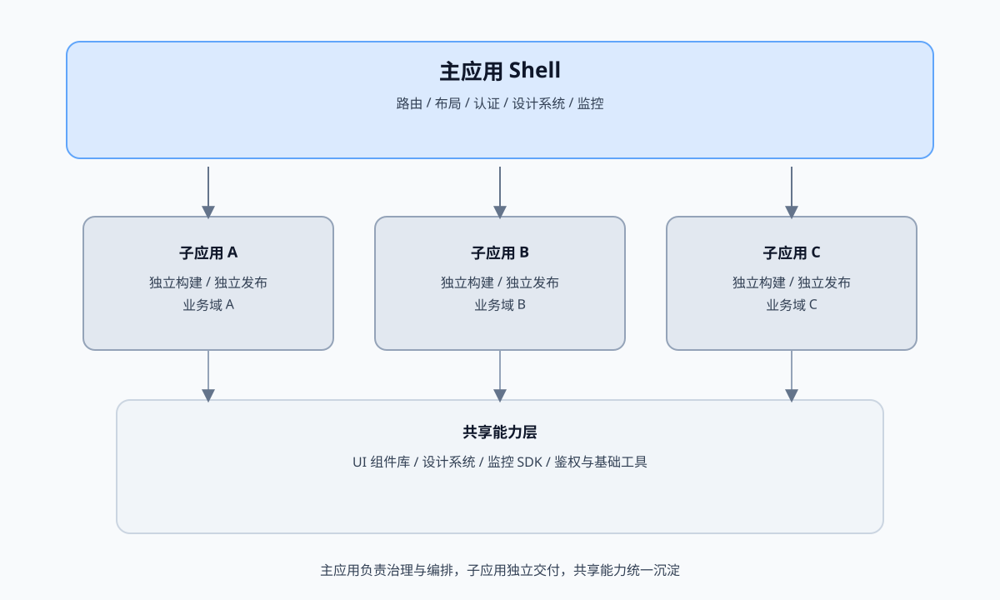

# 话题：微前端背景、方案与最佳实践

> 本文是面向工程落地的深度技术博客，围绕微前端的背景、主流方案与最佳实践展开，强调当下前端工程化与组织协作的现实挑战。

---

## 一、微前端为什么会出现？

前端在十多年的发展中，从「页面脚本」演进为「复杂应用」。当业务体量与团队规模持续扩大，单体前端会遇到典型痛点：

1. **发布耦合**：多个团队共享同一构建与发布链路，任何改动都需要集体协调。
2. **技术锁定**：历史技术栈难以迁移，新业务只能被动接受旧框架。
3. **交付效率低**：构建时间增长、回归成本高，变更影响范围不可控。
4. **组织与代码割裂**：组织边界与代码边界不一致，责任不清、协作低效。

微前端的核心思想是：**将前端应用拆解成多个可以独立开发、独立部署、独立演进的子应用，并在运行时统一编排**。这一思想最早在微前端概念站中被系统阐述，强调其与微服务在组织与部署层面的对齐关系。  
参考：<https://micro-frontends.org/>

---

## 二、目标与基本约束

一个可落地的微前端体系通常具备以下目标：

- **独立交付**：各子应用可单独构建、发布与回滚。
- **技术多样性**：允许不同子应用使用不同框架与版本。
- **体验一致性**：统一的导航、认证、样式基线与交互规范。
- **可观测性**：统一监控、追踪与故障定位方式。

但它也带来新的约束：跨应用通信、资源共享、性能控制、运行时隔离、安全边界等问题必须被显式设计。

---

## 三、方案全景：五类主流实现方式

### 3.1 iframe 集成

**优点**：隔离性最强（JS/CSS/全局变量完全隔离）、接入成本低。  
**缺点**：路由与状态同步困难、体验割裂（滚动/弹窗/全屏）、SEO 与性能较差。  
**适用场景**：强隔离诉求、历史系统快速集成、B 端内嵌后台。

典型通信方式是 `postMessage`，需要严格校验来源与消息结构：

```ts
// host: 发送消息
const frame = document.querySelector("#legacy-frame");
frame?.contentWindow?.postMessage(
  { type: "SET_TOKEN", payload: { token: "xxx" } },
  "https://legacy.example.com"
);

// iframe: 接收消息
window.addEventListener("message", (event) => {
  if (event.origin !== "https://host.example.com") return;
  if (event.data?.type === "SET_TOKEN") {
    console.log("token:", event.data.payload.token);
  }
});
```

### 3.2 Web Components

通过浏览器原生能力（Custom Elements、Shadow DOM 等）实现组件级隔离。  
参考：<https://developer.mozilla.org/en-US/docs/Web/Web_Components>

**优点**：标准化、框架无关、样式隔离能力强。  
**缺点**：生态成熟度与生产级工具链仍有差距，复杂应用治理成本高。  
**适用场景**：UI 组件级共享、跨框架组件输出。

最小可用示例：

```ts
class MicroHeader extends HTMLElement {
  connectedCallback() {
    const shadow = this.attachShadow({ mode: "open" });
    shadow.innerHTML = `
      <style>
        h1 { font-size: 18px; color: #0f172a; }
      </style>
      <h1>Micro Header</h1>
    `;
  }
}
customElements.define("micro-header", MicroHeader);
```

```html
<micro-header></micro-header>
```

### 3.3 运行时框架：single-spa / qiankun

典型做法是通过一个「主应用」统一注册子应用，基于路由或生命周期进行挂载与卸载。  
参考：single-spa：<https://single-spa.js.org/docs/getting-started-overview/>  
参考：qiankun：<https://qiankun.umijs.org/>

**优点**：工程化成熟、生态完备、适合大型团队演进。  
**缺点**：运行时复杂度高，对资源加载与隔离策略要求高。  
**适用场景**：中大型平台、多团队并行开发。

single-spa 的核心注册逻辑示例：

```ts
import { registerApplication, start } from "single-spa";

registerApplication({
  name: "app-vue",
  app: () => System.import("app-vue"),
  activeWhen: ["/app-vue"],
});

start();
```

### 3.4 构建期拼装：Module Federation

Webpack 5 的 Module Federation 支持在运行时加载远程模块，并进行依赖共享与版本协商。  
参考：<https://webpack.js.org/concepts/module-federation/>

**优点**：共享依赖能力强、版本协商清晰、对性能友好。  
**缺点**：构建工具绑定明显，跨框架治理需额外规范。  
**适用场景**：同技术栈、多仓库协作、需要共享基础库的场景。

Host 配置示例：

```js
// webpack.config.js
const { ModuleFederationPlugin } = require("webpack").container;

module.exports = {
  plugins: [
    new ModuleFederationPlugin({
      name: "host",
      remotes: {
        app1: "app1@https://cdn.example.com/app1/remoteEntry.js",
      },
      shared: { react: { singleton: true }, "react-dom": { singleton: true } },
    }),
  ],
};
```

Remote 配置示例：

```js
const { ModuleFederationPlugin } = require("webpack").container;

module.exports = {
  plugins: [
    new ModuleFederationPlugin({
      name: "app1",
      filename: "remoteEntry.js",
      exposes: { "./App": "./src/App" },
      shared: { react: { singleton: true }, "react-dom": { singleton: true } },
    }),
  ],
};
```

### 3.5 Import Maps + ESM

Import Maps 允许在 HTML 中声明模块名与 URL 的映射，是浏览器标准的一部分。  
参考：<https://html.spec.whatwg.org/multipage/webappapis.html#import-maps>

**优点**：标准化、运行时动态化强、适合多仓库发布。  
**缺点**：浏览器兼容与生态仍需评估，需搭配模块加载策略。  
**适用场景**：ESM 体系下的动态模块管理与升级。

HTML 中的 Import Maps 示例：

```html
<script type="importmap">
{
  "imports": {
    "app-shell": "https://cdn.example.com/app-shell/index.js",
    "app-vue": "https://cdn.example.com/app-vue/index.js"
  }
}
</script>
<script type="module">
  import "app-shell";
  import "app-vue";
</script>
```

---

## 四、方案对比与选型建议

| 维度 | iframe | Web Components | single-spa / qiankun | Module Federation | Import Maps |
|---|---|---|---|---|---|
| 隔离性 | 高 | 中高 | 中 | 低 | 低 |
| 体验一致性 | 低 | 中 | 高 | 高 | 高 |
| 技术多样性 | 高 | 高 | 高 | 中 | 高 |
| 性能控制 | 低 | 中 | 中 | 高 | 中 |
| 生态成熟度 | 高 | 中 | 高 | 高 | 中 |

**选型建议**：

1. **需要强隔离或历史系统接入**：优先 iframe。  
2. **需要多团队独立交付 + 高一致性体验**：优先 single-spa / qiankun。  
3. **同技术栈，多仓协作，强调共享依赖**：Module Federation 更合适。  
4. **偏标准化、强调模块动态化**：Import Maps + ESM。

---

## 五、架构基线：主应用 + 子应用

一个稳定的微前端体系通常围绕「主应用」提供以下能力：

- 全局布局与导航
- 统一身份认证与权限
- 统一的设计系统与样式基线
- 统一的路由与资源加载策略
- 统一的监控与埋点

### 5.1 子应用注册清单（Manifest）

建议把子应用元数据集中化，主应用通过清单驱动加载与治理：

```json
{
  "apps": [
    {
      "name": "sub-vue",
      "entry": "https://cdn.example.com/sub-vue/",
      "activeRule": "/app-vue",
      "version": "1.8.3",
      "healthcheck": "/healthz"
    },
    {
      "name": "sub-react",
      "entry": "https://cdn.example.com/sub-react/",
      "activeRule": "/app-react",
      "version": "2.4.1",
      "healthcheck": "/healthz"
    }
  ]
}
```

### 5.2 运行时装载流程（简化版）

1. 主应用解析路由，命中子应用规则  
2. 读取清单，获取入口与版本  
3. 拉取资源并执行生命周期  
4. 注入共享能力（鉴权、埋点、设计系统）

### 5.3 容器约定与挂载点

主应用需要提供稳定的 DOM 容器作为挂载点：

```html
<div id="subapp-container">
  <div id="app"></div>
</div>
```

```
┌──────────────────────────────────────────────┐
│                 主应用 Shell                 │
│  Router / Layout / Auth / Design System      │
└───────────────┬───────────────┬──────────────┘
                │               │
        ┌───────▼───────┐ ┌─────▼──────┐
        │   子应用 A    │ │   子应用 B │
        │  独立构建发布 │ │  独立构建发布│
        └───────────────┘ └────────────┘
```

这意味着「主应用」不是业务容器，而是**平台治理层**。

---

## 六、最佳实践：工程化落地清单

### 6.1 边界划分：按领域而非按页面

拆分应优先贴合业务域与团队边界，而不是简单按 URL 分段。  
推荐优先划分为「独立业务能力」，而非「独立页面集合」。

### 6.2 路由策略：主路由 + 子路由

主应用负责一级路由与资源装载；子应用只关心其内部路由。  
避免子应用直接改写全局路由规则，防止冲突与回退异常。

### 6.3 资源加载与性能治理

- 预加载关键子应用（路由预热）
- 共享基础依赖（框架/工具库）
- 缓存策略与版本锁定并行
- 控制并发加载数，避免主线程阻塞

### 6.4 CSS 与全局污染治理

- 统一设计系统与基础样式基线
- 强制命名空间或 CSS Modules
- 关键业务容器使用局部重置
- 必要时启用 Shadow DOM

### 6.5 跨应用通信策略

优先使用「显式 API」而不是共享全局变量：

- 事件总线（轻量解耦）
- 全局状态管理（需谨慎约束）
- Host 提供的 API（能力接口化）

事件总线示例（建议约束事件名与 payload 结构）：

```ts
type EventMap = {
  "user:login": { userId: string };
  "theme:change": { theme: "light" | "dark" };
};

class Bus {
  private listeners: { [K in keyof EventMap]?: Array<(p: EventMap[K]) => void> } = {};
  on<K extends keyof EventMap>(type: K, fn: (p: EventMap[K]) => void) {
    this.listeners[type] = this.listeners[type] || [];
    this.listeners[type].push(fn);
  }
  emit<K extends keyof EventMap>(type: K, payload: EventMap[K]) {
    (this.listeners[type] || []).forEach((fn) => fn(payload));
  }
}

export const bus = new Bus();
```

Host API 注入示例：

```ts
// host: 在 mount 时注入能力
registerMicroApps([
  {
    name: "sub-vue",
    entry: "//localhost:7101",
    container: "#subapp-container",
    activeRule: "/app-vue",
    props: {
      notify: (msg: string) => console.log("[notify]", msg),
      getToken: () => localStorage.getItem("token"),
    },
  },
]);
```

```ts
// sub-app: 使用 props 能力
export async function mount(props) {
  props.notify("sub-vue mounted");
  const token = props.getToken();
  console.log("token:", token);
}
```

### 6.6 发布与回滚

- 子应用必须支持独立发布与快速回滚
- 主应用保留「版本编排能力」
- 灰度发布与版本锁定同时具备

### 6.7 监控与排障

- 统一接入前端监控平台（错误、性能、资源加载）
- 主应用负责聚合链路与上下文
- 子应用需要带上自身版本与构建信息

### 6.8 构建产物与 `publicPath` 规范

子应用通常需要支持动态 `publicPath`，避免被主应用加载时资源路径错误：

```js
// webpack entry
if (window.__POWERED_BY_QIANKUN__) {
  __webpack_public_path__ = window.__INJECTED_PUBLIC_PATH_BY_QIANKUN__;
}
```

```js
// Vite: base 动态注入示例（伪代码）
const base = process.env.MICRO_BASE || "/";
export default defineConfig({ base });
```

### 6.9 隔离与沙箱策略

qiankun 提供多种隔离策略，建议根据业务风险分级启用：

```ts
import { start } from "qiankun";

start({
  sandbox: {
    strictStyleIsolation: true,
    experimentalStyleIsolation: true,
  },
});
```

### 6.10 依赖共享与版本治理

共享依赖需要「单例 + 版本约束」，避免多实例导致状态错乱：

```js
shared: {
  react: { singleton: true, requiredVersion: "^18.2.0" },
  "react-dom": { singleton: true, requiredVersion: "^18.2.0" }
}
```

### 6.11 预加载与缓存策略

路由预热可以提升体验，但需要控制并发与缓存命中：

```ts
import { start } from "qiankun";

start({ prefetch: "all" });
```

```js
// Service Worker 缓存子应用资源（简化示例）
self.addEventListener("fetch", (event) => {
  if (event.request.url.includes("/sub-app/")) {
    event.respondWith(caches.match(event.request).then((r) => r || fetch(event.request)));
  }
});
```

### 6.12 版本编排与灰度

主应用可以通过清单实现版本锁定与灰度策略：

```json
{
  "apps": [
    { "name": "sub-vue", "entry": "https://cdn.example.com/sub-vue/1.8.3/" },
    { "name": "sub-vue", "entry": "https://cdn.example.com/sub-vue/1.9.0/", "beta": true }
  ]
}
```

### 6.13 安全与跨域边界

建议统一 CSP，并在跨域通信时严格校验：

```html
<meta http-equiv="Content-Security-Policy" content="default-src 'self' https://cdn.example.com">
```

```ts
window.addEventListener("message", (event) => {
  if (event.origin !== "https://cdn.example.com") return;
  if (!event.data || !event.data.type) return;
});
```

---

## 七、典型落地组合

### 方案 A：single-spa + 多框架组合

适合大型平台与多技术栈并行的组织结构。  
重点在于生命周期治理与资源隔离策略。

### 方案 B：Module Federation + 统一技术栈

适合同一技术栈内多仓协作。  
重点在于共享依赖的版本协商与远程模块编排。

### 方案 C：Import Maps + ESM

适合追求标准化、希望通过平台控制模块升级策略的团队。  
重点在于模块映射管理与缓存策略。

---

## 八、实战：qiankun + React 主应用 + Vue 子应用

下面给出一个常见的工程组合，用于说明微前端的落地思路。该方案强调「主应用治理 + 子应用独立交付」。

### 8.1 仓库结构建议

```
micro-frontend/
  apps/
    host-react/     # 主应用（平台治理层）
    sub-vue/        # 子应用（业务域 A）
    sub-react/      # 子应用（业务域 B）
  packages/
    shared-ui/      # 共享组件与设计系统
    shared-sdk/     # 统一埋点、鉴权与工具库
```

### 8.2 主应用注册子应用

主应用负责一级路由与子应用编排。qiankun 核心是注册子应用并在匹配路由时挂载。

```ts
import { registerMicroApps, start } from "qiankun";

registerMicroApps([
  {
    name: "sub-vue",
    entry: "//localhost:7101",
    container: "#subapp-container",
    activeRule: "/app-vue",
  },
  {
    name: "sub-react",
    entry: "//localhost:7102",
    container: "#subapp-container",
    activeRule: "/app-react",
  },
]);

start();
```

### 8.3 主应用路由与布局示例

主应用通常负责全局布局与一级路由，子应用被挂载在固定容器中：

```tsx
import { BrowserRouter, Routes, Route, Navigate } from "react-router-dom";

export default function App() {
  return (
    <BrowserRouter>
      <div className="shell">
        <aside>导航</aside>
        <main id="subapp-container">
          <Routes>
            <Route path="/" element={<Navigate to="/app-vue" />} />
            <Route path="/app-vue/*" element={<div id="app" />} />
            <Route path="/app-react/*" element={<div id="app" />} />
          </Routes>
        </main>
      </div>
    </BrowserRouter>
  );
}
```

### 8.4 子应用生命周期（以 Vue 为例）

子应用需要导出标准生命周期，以便被主应用挂载与卸载。

```ts
import { createApp } from "vue";
import App from "./App.vue";

let app = null;

export async function bootstrap() {}

export async function mount(props) {
  const container = props?.container?.querySelector("#app") || "#app";
  app = createApp(App);
  app.mount(container);
}

export async function unmount() {
  if (app) {
    app.unmount();
    app = null;
  }
}
```

### 8.5 子应用构建配置要点

以 Webpack 为例，需要导出 UMD 并配置跨域头：

```js
// webpack.config.js
module.exports = {
  output: {
    library: "sub-vue",
    libraryTarget: "umd",
  },
  devServer: {
    headers: {
      "Access-Control-Allow-Origin": "*",
    },
  },
};
```

### 8.6 路由与资源治理要点

- 子应用路由需要带上自己的基路径（例如 `/app-vue`），避免与主路由冲突。
- 静态资源路径要可配置，确保在被主应用加载时不出现 404。
- 若有样式冲突风险，可启用 qiankun 的样式隔离策略或约束 CSS 命名空间。

### 8.7 统一样式基线示例

建议由主应用提供基础样式重置，避免子应用样式冲突：

```css
/* host.css */
*, *::before, *::after { box-sizing: border-box; }
body { margin: 0; font-family: "PingFang SC", "Microsoft YaHei", sans-serif; }
#subapp-container { min-height: 100vh; background: #f8fafc; }
```

### 8.8 跨应用通信示例

建议使用 Host 提供的显式 API 或事件总线，避免共享全局变量。

```ts
export async function mount(props) {
  const { onGlobalStateChange } = props;
  onGlobalStateChange((state) => {
    console.log("global state:", state);
  }, true);
}
```

---

## 九、架构图（SVG）



---

## 十、测试与验收清单

微前端的验收不只是功能可用，更强调「跨应用协同」与「回归效率」：

- 路由切换与挂载/卸载是否稳定
- 子应用资源是否按需加载，缓存是否命中
- 共享依赖是否被单实例复用
- 监控是否带上子应用版本号

E2E 测试建议覆盖跨应用跳转：

```ts
import { test, expect } from "@playwright/test";

test("micro-app navigation", async ({ page }) => {
  await page.goto("http://localhost:3000");
  await page.click("text=进入 Vue 子应用");
  await expect(page.locator("#subapp-container")).toContainText("Vue");
});
```

## 十一、性能与稳定性指标

建议建立统一指标口径，至少包含：

- 首屏时间（FCP/LCP）
- 交互延迟（INP）
- 子应用加载耗时与失败率

Web Vitals 采集示例：

```ts
import { onCLS, onLCP, onINP } from "web-vitals";

onCLS((m) => reportMetric("CLS", m));
onLCP((m) => reportMetric("LCP", m));
onINP((m) => reportMetric("INP", m));

function reportMetric(name, metric) {
  fetch("/metrics", {
    method: "POST",
    body: JSON.stringify({ name, value: metric.value }),
    headers: { "Content-Type": "application/json" },
  });
}
```

---

## 十二、常见误区

1. **把微前端当成万能拆分工具**：不是所有项目都需要微前端。  
2. **忽略体验一致性**：视觉和交互不统一会造成严重割裂。  
3. **忽略治理成本**：团队协作、监控、版本管理都需要平台化投入。  
4. **不做渐进式迁移**：正确做法是增量式「外科手术」。

---

## 参考资料

- Micro Frontends 概念站：<https://micro-frontends.org/>
- single-spa 文档：<https://single-spa.js.org/docs/getting-started-overview/>
- qiankun 文档：<https://qiankun.umijs.org/>
- Webpack Module Federation：<https://webpack.js.org/concepts/module-federation/>
- Web Components（MDN）：<https://developer.mozilla.org/en-US/docs/Web/Web_Components>
- Import Maps（HTML Standard）：<https://html.spec.whatwg.org/multipage/webappapis.html#import-maps>
