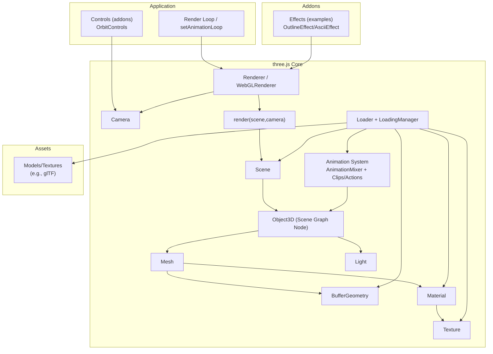
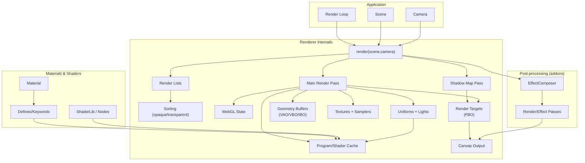

# three.js 架构概览

下面是 three.js 的高层架构划分，聚焦于运行时的核心模块与常见扩展位置。

## 架构要点

- 渲染核心：`Renderer` 负责把 `Scene` 与 `Camera` 组合成最终画面（`render(scene, camera)`）。
- 场景图：`Scene` 作为根节点，`Object3D` 构成层级树，`Mesh`、`Light` 等作为节点参与渲染。
- 几何与材质：`Mesh = BufferGeometry + Material`，`Material` 可引用 `Texture`。
- 资源加载：`Loader` 体系（配合 `LoadingManager`）从外部资源构建场景、几何、材质、纹理与动画数据。
- 动画系统：`AnimationMixer` 驱动 `AnimationClip/Action` 并作用在 `Object3D` 上。
- 扩展/示例：`Controls`、`Effects` 等作为附加模块插入渲染流程或交互流程。

## Mermaid 架构图

## Mermaid 渲染管线细化图

